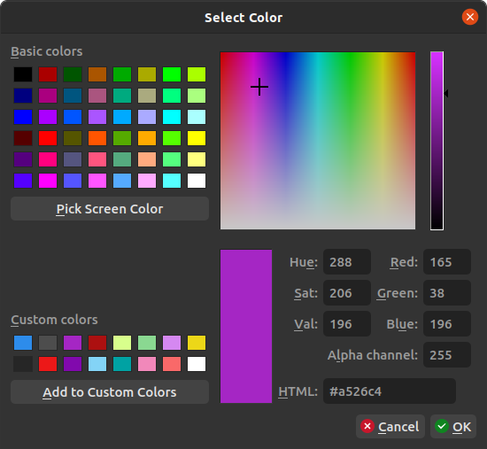
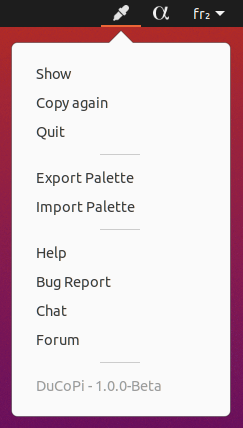

# DuCoPi - The Duduf Color Picker

***DuCoPi*** is a simple color picker and color palette.



With *DuCopi*, no matter what is your current application, you always keep the colors you need in a simple palette, always available. And you can always pick any other color from the selector or from any pixel of your screen.

- It stays at hand, always available when you need it.
- It can pick any color on your screen.
- It automatically copies your selected color's hex code
- It keeps a color palette for you (a list of custom colors)
- It is able to import and export this palette (in a *Gimp*/*Inkscape* format)

The best way to use it is to add it to your startup applications.

[TOC]

## {style="width:28px"} Basic use

Just click on the eyedropper icon in your system tray, or select "show" from the menu. Choose your color, click `ok` to copy it.



## {style="width:28px"} Custom palette

The swatches on the lower left part are your custom palette. Select a swatch, change the color, and click `Add to custom colors` to keep this color in the selected swatch. Click `ok` to validate and save your palette.

## {style="width:28px"} Import / {style="width:28px"} Export palette

You can export the current palette by choosing `Export Palette` in the menu. It is saved as a `.gpl` file, which is the format used by *The Gimp* and *Inkscape* too.

Palettes can also be imported by choosing `Import Palette` in the menu. For now, only `.gpl` files are supported.

*Gimp Palettes* (`.gpl`) files are very simple text files you can edit by yourself if you need. Each line after the `#` character represent a swatch in the palette.They store red, green, blue values (as 8 bits integers) and a custom name.

This is a *Gimp Palette* example:

```
GIMP Palette
Name: RxUI Tints
#
  0 162 163	Dark Cyan
 16 104 142	Dark Blue
 62 139  69	Dark Green
129   9 173	Dark Purple
132  44  83	Dark Pink
132 179  48	Dark Citrus
172  16  16	Dark Red
  0 162 163	Light Cyan
131 211 246	Light Blue
138 216 145	Light Green
213 136 241	Light Purple
216 255 140	Light Citrus
236 215  24	Yellow
241 136 186	Light Pink
249 105 105	Light Red
```

## License

### Software

The software this documentation is referring to is licensed under the ***GNU General Public License***.

<span style="font-size:0.75em;">**Copyright (C)  2020 Nicolas Dufresne and Contributors.**  
This program is free software; you can redistribute them and/or modify them under the terms of the GNU General Public License as published by the Free Software Foundation; either version 3 of the License, or (at your option) any later version.</span>

<span style="font-size:0.75em;">This program is distributed in the hope that it will be useful, but WITHOUT ANY WARRANTY; without even the implied warranty of MERCHANTABILITY or FITNESS FOR A PARTICULAR PURPOSE. See the GNU General Public License for more details.</span>

<span style="font-size:0.75em;">You should have received a copy of the *GNU General Public License* along with this program . If not, see [http://www.gnu.org/licenses/](http://www.gnu.org/licenses/).</span>

{: style="height:75px;"} {: style="height:50px;"}

### Icons and other graphical elements

All graphical elements, especially icons, are from [***RxUI***](http://rxui-docs.rainboxlab.org) by Nicolas Dufresne and [RxLaboratory](https://rainboxlab.org) are licensed under [CC BY-NC-SA 4.0](https://creativecommons.org/licenses/by-nc-sa/4.0/).

<span style="font-size:0.75em;">**Copyright (C) 2021 Nicolas Dufresne and Contributors.**

[{: style="height:35px;"} {: style="height:35px;"} {: style="height:35px;"} {: style="height:35px;"}](https://creativecommons.org/licenses/by-nc-sa/4.0/)

### This Documentation

<span style="font-size:0.75em;">**Copyright (C)  2020 Nicolas Dufresne and Contributors.**  
Permission is granted to copy, distribute and/or modify this document under the terms of the GNU Free Documentation License, Version 1.3 or any later version published by the Free Software Foundation;  
with no Invariant Sections, no Front-Cover Texts, and no Back-Cover Texts.
A copy of the license is included in the section entitled "[Documentation License](licenses/gfdl.md)".</span>

{: style="height:75px;"} {: style="height:50px;"}

